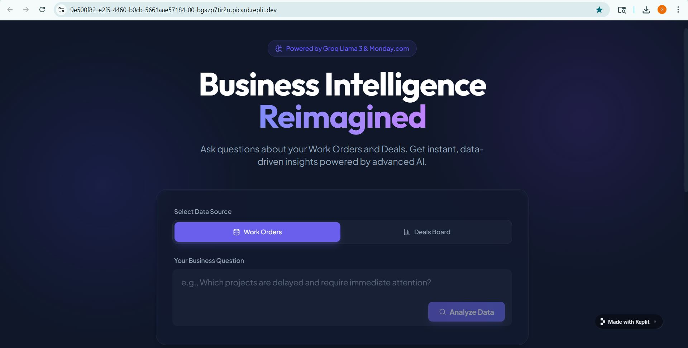
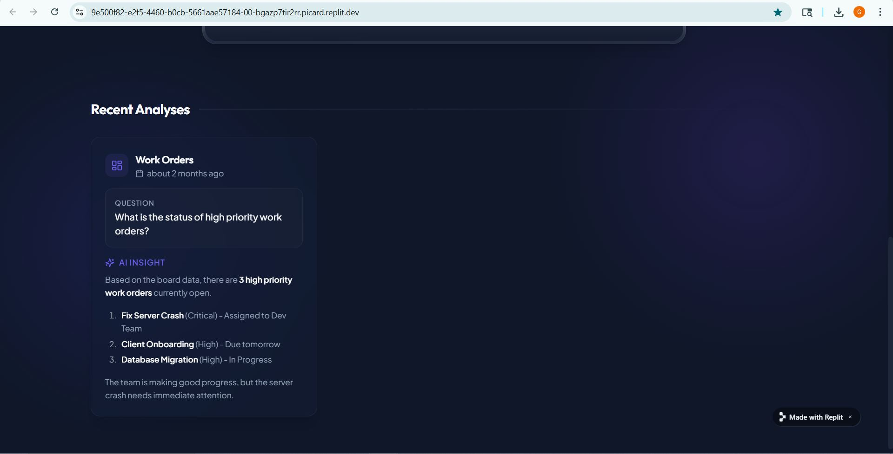

#  Monday.com Business Intelligence Agent

> AI agent that answers natural language business questions about Monday.com data in seconds.

 **[Live Demo](https://9e500f82-e2f5-4460-b0cb-5661aae57184-00-bgazp7tir2rr.picard.replit.dev/)** | 📖 **[Decision Log](DECISION_LOG.md)**
## Important: Replit Free Tier Note
This app is hosted on Replit's free tier. 

For a production deployment, this would be hosted on an always-on service like Render or Railway.
---

##  The Problem

Executives need quick answers across multiple Monday.com boards. Current process:
- Manually export data
- Clean inconsistent formats  
- Run custom analysis for each question
- Deal with missing data

**This agent provides instant AI-powered insights through natural language queries.**

---

##  What It Does

-  Ask questions in plain English
-  Analyzes Work Orders & Deals data from Monday.com
-  Handles messy real-world data (missing values, inconsistent formats)
-  Provides business insights, not just raw numbers
-  Real-time data (no hardcoded CSVs)

### Example Questions:
- "How's our pipeline for energy sector this quarter?"
- "What's our total revenue from closed deals?"
- "Show me high priority work orders"
- "Which sectors are performing best?"

---

##  Screenshots

### Main Interface


### AI Analysis OUTPUT


---

##  Tech Stack

**Frontend:** React  
**Backend:** Node.js  
**AI:** Groq API (Llama 3.3 70B)  
**Data:** Monday.com GraphQL API  
**Hosting:** Replit  

---

##  Quick Start
```bash
# Clone
git clone https://github.com/yourusername/monday-bi-agent.git
cd monday-bi-agent

# Install
npm install

# Configure .env
MONDAY_API_KEY=your_key
GROQ_API_KEY=your_key
WORK_ORDERS_BOARD_ID=your_id
DEALS_BOARD_ID=your_id

# Run
npm start
```

**Setup Details:**
1. Import CSVs to Monday.com as separate boards
2. Get API key from Monday.com → Developers
3. Get free Groq API key from console.groq.com
4. Copy board IDs from Monday.com URLs

---

##  Architecture
```
User Question → API Gateway → Monday.com (fetch data) → Groq AI (analyze) → Insights
```

**Key Features:**
- Dynamic GraphQL queries (only fetches needed data)
- Handles missing/inconsistent data gracefully
- Provides caveats when data is incomplete

---

##  Key Decisions

**Why Groq?** Free, fast, no credit card needed for prototyping

**Why GraphQL?** Flexible data fetching, only get what we need

**Why direct API?** Simpler debugging, better docs than MCP for this timeline

**Data Quality:** Flags incomplete data, normalizes formats, never guesses

See **[DECISION_LOG.md](DECISION_LOG.md)** for detailed technical decisions.

---

##  Future Improvements

**Short-term:**
- Data visualization (charts/graphs)
- Caching for faster responses
- PDF export for leadership reports

**Long-term:**
- Predictive analytics (forecast revenue)
- Natural language actions ("Create a work order for...")
- Fine-tuned model on company terminology

---

##  What I Learned

- AI prompt engineering for business intelligence
- Handling real-world messy data
- GraphQL API optimization
- Building under time pressure (built in 4-6 hours)

**Challenge:** Groq token limits with large datasets  
**Solution:** Implemented data filtering before AI call

---

##  Project Context

Built as a technical assignment demonstrating:
✅ AI agent development  
✅ API integration  
✅ Real-time data analysis  
✅ Production-quality code in 6 hours  

---

## Assignment Requirements Met

- ✅ Dynamic Monday.com integration (no hardcoded data)
- ✅ Handles messy data gracefully
- ✅ Natural language understanding
- ✅ Business intelligence insights
- ✅ Leadership update preparation

---

##  Contact

**Geeta Math**  
📧 gsmvjp@gmail.com | 💼 [LinkedIn](https://www.linkedin.com/in/geeta-math-128874353/) | 🌐 [Portfolio](https://geetamath.github.io/portfolio/)

---

## ⚠️ Note
Hosted on Replit free tier. If link shows "Run this app", wait 30 seconds for wake-up or contact me for immediate demo.

---

*Built with ❤️ as a demonstration of AI agent capabilities for business intelligence*

**⭐ Star this repo if you found it useful!**
